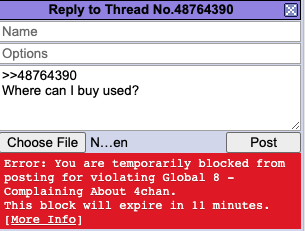
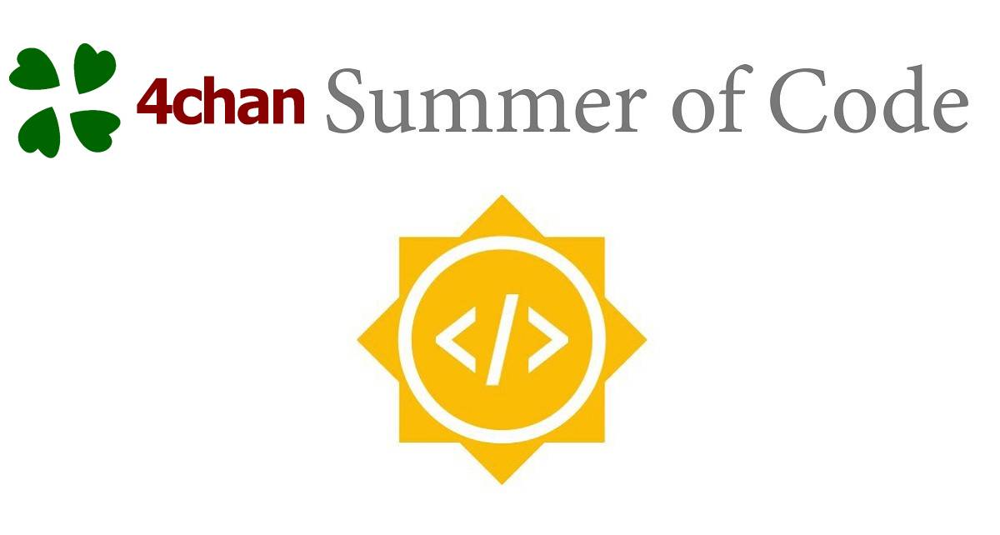

# chanban
steps/tools/tips and scripts to help bypass a 4chan ban

I've unfortunately been browsing /g/ since 2010. I was here when we called Bitcoins Buttcoin. I stopped browsing when /biz/ was spliced off (a mistake in hindsight). Things were very different when m00t ran the website. In today's 4chan, my threads are constantly being deleted and I'm recieving global bans from janitors on boards I don't even frequent. (I got a global ban from a /tv/ janitor). Also, all of these violations were for being "off-topic" even though they were on topic. You see where this is going? 4chan has always been a beacon of free speech on the internet. People can say nigger but I cannot speak about gun politics, on a gun forum. 

Stupid

- Links
- https://github.com/dessant/buster
- https://github.com/ecthros/uncaptcha
- https://github.com/ozgurkayaist/Google-Recaptcha-Solver-SeleniumAutomation
